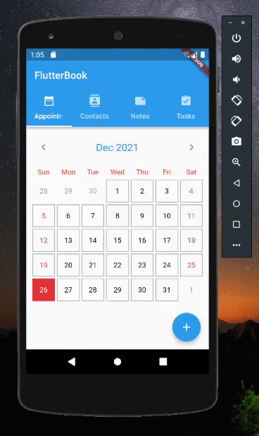
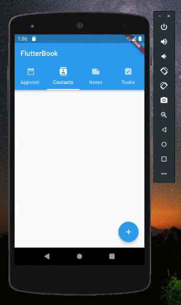
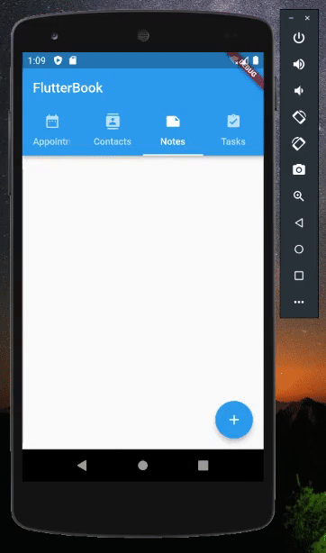
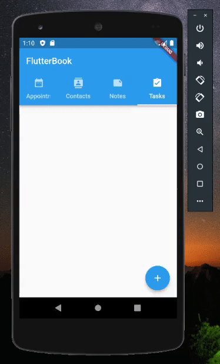

# FlutterBook

Improved and updated version of the Personal Information Manager (PIM) for appointments, contacts, notes, and tasks.

---

## Dependencies

- [scoped_model](https://pub.dev/packages/scoped_model/versions/2.0.0-nullsafety.0)
- [sqflite](https://pub.dev/packages/sqflite)
- [flutter_slidable](https://pub.dev/packages/flutter_slidable)
- [path_provider](https://pub.dev/packages/path_provider)
- [intl](https://pub.dev/packages/intl)
- [image_picker](https://pub.dev/packages/image_picker)
- [flutter_calendar_carousel](https://pub.dev/packages/flutter_calendar_carousel)

---

## Previews

<h3 align="center">📅 Appointments</h3>

 

    

  

<h3 align="center">📱 Contacts</h3>

 

    

  

<h3 align="center">✍️ Notes</h3>

 

    

  

<h3 align="center">✅ Tasks</h3>

 

    

