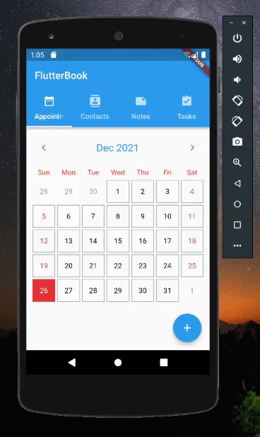
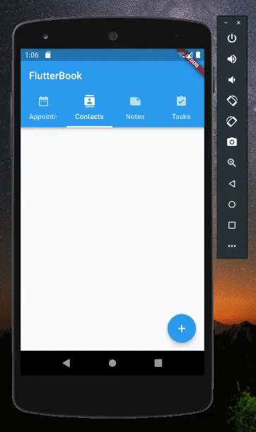
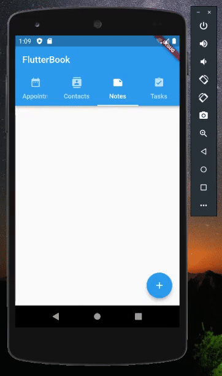
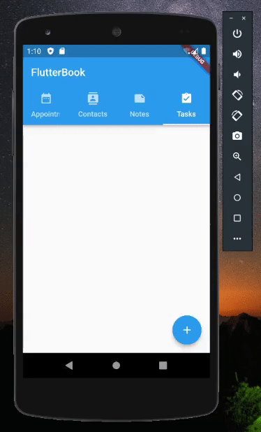

# FlutterBook

Improved and updated version of the Personal Information Manager (PIM) for appointments, contacts, notes, and tasks.

---

## :toolbox: Dependencies

- [Scoped Model (Null Safety)](https://pub.dev/packages/scoped_model/versions/2.0.0-nullsafety.0)
- [SQLite](https://pub.dev/packages/sqflite)
- [Flutter Slidable](https://pub.dev/packages/flutter_slidable)
- [Path Provider](https://pub.dev/packages/path_provider)
- [Intl](https://pub.dev/packages/intl)
- [Image Picker](https://pub.dev/packages/image_picker)
- [Flutter Calendar Carousel](https://pub.dev/packages/flutter_calendar_carousel)

---

## :eyes: Previews

<h3 align="center">📅 Appointments</h3>

 

    

  

<h3 align="center">📱 Contacts</h3>

 

    

  

<h3 align="center">✍️ Notes</h3>

 

    

  

<h3 align="center">✅ Tasks</h3>

 

    

